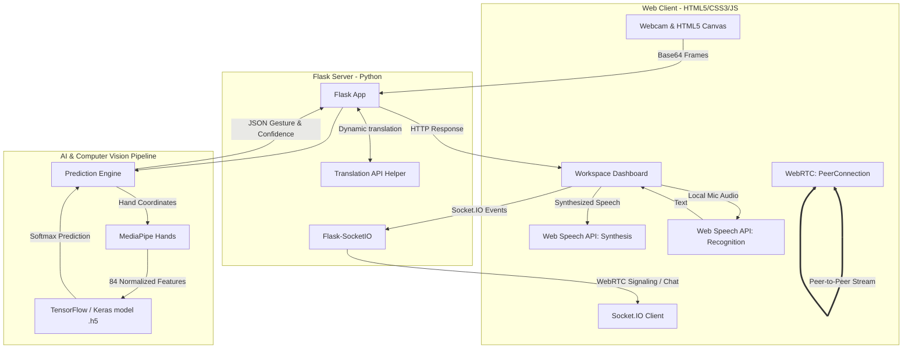

# Technology Stack Overview — ISL Communication Assistant
**Final Year Project | Department of Computer Science & Engineering**

---

This document summarizes the technology stack used in the **ISL (Indian Sign Language) Communication Assistant** application, categorized by system components and functional responsibilities. Use this guide to prepare your presentation slides, project reports, or viva answers.

---

## 1. High-Level Architectural Diagram

The diagram below outlines how the components interact during real-time communication:

---

## 2. Tech Stack Matrix (What is Used for What)

| Component / Layer | Technology | Usage in Project |
| :--- | :--- | :--- |
| **Programming Language** | **Python 3.9 / 3.10** | Core backend language, ML training scripts, data processing, and offline testing CLI utilities. |
| **Deep Learning Library** | **TensorFlow & Keras** | Designing, compiling, training, and exporting the Neural Network model (`.h5` and `.tflite` formats). |
| **Computer Vision Engine** | **OpenCV (`opencv-python`)** | Image acquisition from webcam, color spaces conversion (BGR to RGB), frame flipping, drawing skeleton overlays, and rendering desktop windows. |
| **Hand Tracking Engine** | **MediaPipe (`mediapipe`)** | Extracts 21 3D hand landmarks in real-time. Detects dual-hand structures for complex gestures. |
| **Data Science Pipeline** | **Pandas, NumPy, Scikit-learn** | Structured feature logging (`landmarks.csv`), coordinate normalization, stratified dataset splitting, label encoding, and data augmentation. |
| **Web Server Framework** | **Flask (Python)** | Serving web templates, asset routing, host APIs (`/predict`, `/text_to_sign`, `/state`, `/action`). |
| **Real-time WebSockets** | **Flask-SocketIO & socket.io.js** | Syncing call states, WebRTC SDP handshakes/ICE exchanges, and instant textual messages between participants. |
| **Peer-to-Peer Video Call** | **WebRTC (`RTCPeerConnection`)** | Enabling direct device-to-device audio/video streaming for the Bilingual Video Call interface. |
| **Web UI & Styling** | **HTML5 & CSS3 (Vanilla)** | Rich, responsive user interface featuring glassmorphic overlays, unified sidebars, and dark-theme dashboards. |
| **Web Speech Services** | **HTML5 Web Speech API** | Client-side Text-to-Speech (TTS) synthesizer and Speech-to-Text (STT) voice recognition. |
| **Desktop Speech Services**| **pyttsx3 & SpeechRecognition** | Offline Text-to-Speech engine and voice input handler for the desktop CLI fallback scripts. |
| **Translation Engine** | **Static Dicts + Google Translate API**| Bidirectional translation between English texts/signs and Kannada words/phonetics. |

---

## 3. Deep Dive into Key Technical Components

### A. Machine Learning Pipeline (MediaPipe + Neural Network)
1. **Feature Extraction**:
   - OpenCV captures frames. MediaPipe extracts **21 landmarks** per hand.
   - Total landmarks processed: $2 \text{ hands} \times 21 \text{ landmarks} = 42 \text{ landmarks}$.
   - Each landmark contains $(x, y)$ coordinates $\rightarrow$ **84 total feature inputs**.
2. **Feature Normalization**:
   - Subtracts the wrist base coordinates ($x_0, y_0$) from all other hand coordinates to make detection **translation-invariant**.
   - Divides the offset coordinates by the maximum coordinate range to make detection **scale-invariant**.
3. **Data Augmentation**:
   - **Hand-Swapping**: Swaps the feature columns of left and right hands to train the model to be invariant to MediaPipe handedness misclassification errors.
   - **Gaussian Coordinate Jittering**: Adds noise ($\sigma=0.015$) to hand features during training to simulate web camera noise and hand tremors.
4. **Model Architecture**:
   - **Type**: Multi-Layer Perceptron (MLP) Sequential Classifier.
   - **Layers**:
     - Input Layer: Shape of `(84,)`
     - Dense Layer 1: `256` nodes, ReLU activation, BatchNormalization, Dropout (`0.3`)
     - Dense Layer 2: `128` nodes, ReLU activation, BatchNormalization, Dropout (`0.3`)
     - Dense Layer 3: `64` nodes, ReLU activation, BatchNormalization, Dropout (`0.2`)
     - Output Layer: `num_classes` nodes, Softmax activation (generates class probability distributions).
   - **Optimizer**: Adam ($lr = 0.001$), Loss: Sparse Categorical Crossentropy.
   - **Regularization**: Early Stopping (patience=12) to prevent overfitting by saving weights at the minimum validation loss.

### B. Web Interface and WebRTC Call Architecture
- **Webpage Rendering**: Flask serves the main workspace dashboard containing three responsive sections:
  1. **Sign to Speech**: Continuous local webcam streaming + server-side predictions.
  2. **Text to Sign**: Text/Voice processing which renders custom sign animation arrays based on word/character matching folders.
  3. **Video Call**: Multi-device communication.
- **WebRTC Signaling Flow**:
  1. Devices connect to Flask-SocketIO.
  2. Peer A triggers a room join $\rightarrow$ Socket.IO relays Peer A's presence to Peer B.
  3. Peer A generates a local SDP (Session Description Protocol) offer $\rightarrow$ relayed via Socket.IO $\rightarrow$ Peer B sets remote description.
  4. Peer B responds with SDP answer $\rightarrow$ relayed back $\rightarrow$ Peer A sets remote description.
  5. ICE candidates are gathered and shared to establish a direct P2P stream, bypassing server bandwidth limits.
- **Client-Side Processing**:
  - The client webcam captures frames, writes them to an in-memory HTML5 Canvas, downsamples/compresses them, and sends base64 representations to the `/predict` API endpoint to avoid local CPU bottlenecks.

### C. Bilingual Translation Subsystem
- **Sign Language to Voice (Deaf $\rightarrow$ Hearing)**:
  1. Hand gestures are translated into characters/words in real-time.
  2. Text is passed into translation helper dictionary / HTTP translation helper.
  3. **English $\rightarrow$ Kannada** converter yields Kannada text and its romanized phonetic form (e.g., `"HELLO"` $\rightarrow$ `"ನಮಸ್ಕಾರ"` / `"Namaskara"`).
  4. Client-side browser synthesizes speech in English or Kannada depending on the setting.
- **Voice to Sign Language (Hearing $\rightarrow$ Deaf)**:
  1. Microphone captures speaker's audio.
  2. Browser's SpeechRecognition API yields raw text.
  3. Text splits into words and checks if a dedicated image exists in the `isl_signs/` directory.
  4. If not, it falls back to the dataset folder to loop through individual frames of that word, or spells it letter-by-letter as a fallback slideshow.

---

## 4. Key Questions You Can Expect in Your Presentation (QA Prep)

* **Q: Why use MediaPipe instead of directly passing the full webcam image into a CNN (Convolutional Neural Network)?**
  - *Answer*: Passing full raw images introduces extreme variations in lighting, background clutter, and skin tones, requiring a massive dataset and huge training times. MediaPipe abstracts away these variables by extracting structural hand skeletons (21 coordinate points), reducing the input size to just 84 numbers. This allows us to train a super-fast, lightweight MLP model that runs in real-time on standard laptops without GPUs.

* **Q: How does the system handle scaling (getting closer/farther from camera) and hand translation?**
  - *Answer*: We perform coordinate normalization: (1) we calculate relative coordinates by subtracting the wrist coordinates from all other points, rendering it invariant to the hand's location in the frame. (2) we divide the relative coordinates by the maximum coordinates distance, which scales all points between $[-1.0, 1.0]$, making the prediction invariant to distance from the camera.

* **Q: How is WebRTC signaling coordinated without a dedicated TURN/STUN server config shown here?**
  - *Answer*: WebRTC uses Socket.IO (running on Flask) as a signaling channel to swap session configurations (SDP) and connection candidates (ICE). For local networks or open networks, standard WebRTC utilizes default public Google STUN servers to resolve public IP addresses and establish a peer-to-peer route.
